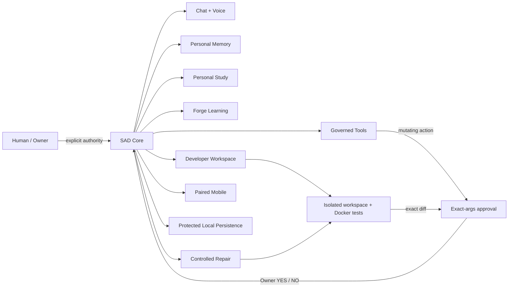

# SAD — Sandbox Adaptive Dialogue

**A local-first AI platform that keeps memory, tools, coding, repair, and agent authority under explicit human control.**

SAD is built for people who want useful AI automation **without handing the model unrestricted authority over the machine, credentials, memory, or codebase**.

> **Alpha Stable:** the repository-backed SAD + Forge contract is frozen and verified by fail-closed release gates. Physical-device and deployment acceptance remain separate and are never inferred from code tests alone.

## Why SAD exists

Most agent systems optimize for giving the model more tools. SAD optimizes for giving the model **only the authority the human explicitly granted**.

SAD combines:

- **Local-first operation** with loopback model support and visible fallbacks.
- **Explicit personal memory** instead of silently turning conversations into permanent memory.
- **Governed tool actions** where state-changing actions require approval tied to the exact argument hash.
- **Isolated coding and repair** with scoped workspaces, Docker verification, exact diffs, and Owner apply/rollback.
- **Forge Learning** for structured study and game-oriented learning workflows.
- **Account and RBAC boundaries** across Chat, Memory, Tools, Study, Forge, coding, repair, mobile, and platform integrations.
- **Protected local persistence and recovery** with Windows DPAPI and encrypted portable backup support.

The goal is not an autonomous AI with broad machine control. The goal is a **human-governed AI platform that can become more capable without quietly becoming more powerful than its operator intended**.

## Architecture at a glance



## 60-second orientation

If you are evaluating SAD, start here:

1. Read this README for the platform boundaries.
2. Review `ALPHA_STABLE.md` for the frozen Alpha contract.
3. Run `python alpha_stable.py` to verify the declared Alpha surface.
4. Run `python protocol_black.py` to exercise the fail-closed security gate.
5. On the real Windows deployment host, run `python windows_doctor.py` before starting SAD.

Windows launch:

```powershell
python -m pip install -r requirements.txt
python windows_doctor.py
.\start_sad_windows.ps1
```

## What makes SAD different

| Area | SAD approach |
| --- | --- |
| Memory | Explicit user-controlled durable memory; ordinary chat is not silently promoted to long-term memory |
| Tools | Reviewed catalog; state-changing actions require approval bound to exact arguments |
| Coding | Human-approved scope → isolated workspace → local AI edits → Docker tests → exact diff → Owner decision |
| Repair | Failure-driven draft → isolated test → exact diff → Owner approval/rollback |
| Credentials | Scoped local-app credentials; machine clients do not inherit user authority |
| Git | Coding/repair agents receive no commit, push, fetch, rebase, merge, or credential authority |
| Network | Core remains loopback-oriented; mobile access uses a separate paired TLS gateway |
| Release claims | Code gates prove the declared contract only; hardware and human UAT stay separate |

## Platform Core v0.3-alpha

`platform_registry.py` defines the declarative platform catalog. Platform schema is `3`;
the HTTP API remains `v1`. Platform metadata never grants authority. Concrete endpoints
still enforce authentication, RBAC, workflow state, source hashes, Docker evidence, and
Owner approval where required.

Built-in modules include SAD Platform Core, Chat, Voice, Personal Memory, governed Tools,
Personal Study, Forge, Developer Workspace, Accounts/Roles, and Mobile.

## Runtime data and Windows at-rest protection

Private application state belongs outside source/control surfaces. The live/default
Windows data layer uses:

```text
local_data/sad_runtime.sqlite3
```

Protected runtime namespaces now include:

- accounts and profiles;
- Chat history;
- Forge/student progress;
- mobile pairing/device trust state;
- failure records;
- Owner/Developer dashboard evidence;
- dialogue settings;
- Personal Memory;
- governed Tool Actions;
- Platform local-app registrations;
- Platform events.

On Windows, document payloads are protected with the current Windows user's DPAPI context
before persistence. Passwords remain salted one-way PBKDF2 verifier material rather than
becoming decryptable.

Validated legacy state is imported only when the matching SQLite namespace is absent,
read back for verification, then archived. Protected Windows startup also protects
legacy-import archives. If both encrypted state and a live legacy copy appear
authoritative, startup fails closed rather than guessing.

Explicit custom file paths remain available for isolated tests and compatibility/recovery
tooling. They are not the live/default protected persistence claim.

## Native and portable backup/recovery

For routine recovery under the same Windows protection context:

```powershell
python backup.py create D:\SAD-Backups\sad-native.sadbak
python backup.py verify D:\SAD-Backups\sad-native.sadbak
```

For disaster recovery across Windows profiles or replacement Windows machines:

```powershell
python backup.py portable-create D:\SAD-Backups\sad-portable.sadbak
python backup.py portable-verify D:\SAD-Backups\sad-portable.sadbak
```

Portable backup passphrases are prompted interactively and are never accepted as command
arguments or stored by SAD. Portable containers use AES-256-GCM through exactly pinned
PyCA `cryptography`, with PBKDF2-HMAC-SHA256 passphrase derivation and random salt/nonce.

A portable export does **not** merely wrap a source-user DPAPI database. SAD exports the
runtime database to a host-neutral representation only in memory inside the encrypted
container. On portable restore, every runtime document is re-protected with the
destination Windows user's DPAPI context before staged/live SQLite bytes are written.

Restore remains explicit and offline-oriented:

```powershell
python backup.py restore D:\SAD-Backups\sad-native.sadbak --confirm
python backup.py portable-restore D:\SAD-Backups\sad-portable.sadbak --confirm
```

Both formats retain manifest/hash/path checks, SQLite integrity verification, staged
replacement, explicit approval, and rollback on partial restore failure. See `BACKUP.md`,
`ENCRYPTION.md`, and `ENCRYPTION_TIER2_UAT.md`.

## Conversation and Voice

SAD Chat persists account-owned sessions and recent conversation context. When the
configured loopback local model is healthy, replies are labeled `Local AI`; otherwise SAD
visibly falls back to `Built-in dialogue` where fallback is supported.

`POST /v1/voice/turn` provides authenticated transcript-to-conversation transport.
`voice_runtime.py` and `voice_client.py` add a provider-neutral local audio path:

```text
WAV -> loopback STT -> SAD Voice -> loopback TTS -> WAV
```

Speech services are restricted to explicitly configured loopback HTTP endpoints and gain
no SAD account/tool/coding/Git authority. Physical microphone capture and speaker playback
still require real host/client UAT. See `VOICE.md`.

## Personal Memory and governed Tools

SAD does not automatically copy ordinary conversation into long-term Memory. A signed-in
account explicitly creates/searches/edits/enables/expires/deletes its own memories, and a
turn can set `use_memory: false`.

The reviewed internal tool catalog remains deliberately small:

- `platform.status`
- `memory.search`
- `memory.remember`
- `memory.forget`

State-changing tools require explicit approval tied to the exact argument hash. There is
no generic shell, arbitrary URL/network tool, dynamic plugin/Python loader, package
installer, unrestricted filesystem tool, or Git tool.

## Coding and controlled repair

General coding:

```text
task -> human-approved file scope -> private workspace -> local AI edits
     -> Docker tests -> exact diff -> Owner apply/rollback
```

Failure-driven repair:

```text
failure -> human triage -> scoped repair draft -> isolated Docker tests
        -> exact diff -> Owner YES/NO -> verified local apply/rollback
```

Coding and repair agents receive no Git commit/push/fetch/rebase/merge/credential
authority.

## Local app integration

Owner can create scoped loopback `SAD-App` credentials for companion software. Machine
credentials remain read-only/control-plane scoped to Platform discovery, compatibility,
and approved metadata events. They cannot impersonate users or enter Chat, Memory, Tools,
Study, Forge, coding, repair, account, mobile-admin, or Git flows. See `PLATFORM_SDK.md`.

## Mobile

`mobile.py` keeps Core loopback-only and starts a separate paired TLS gateway on one
explicit private/approved-overlay IPv4 address. Learning-mode phones can use their own
Chat, Voice, Memory, governed Tools, Study, Forge, and progress. Machine-client endpoints
stay blocked through Mobile. Static PWA shell assets may cache; `/v1/*` and `/mobile/*`
private traffic never does. See `MOBILE.md`.

## Windows readiness

CI runs the full suite, Protocol Black, release gate, and Alpha preflight on Ubuntu
Python 3.11 plus Windows Python 3.11 and 3.12. CI installs the exact pinned portable crypto
dependency and Windows preflight requires real DPAPI plus protected-runtime readiness.

On the actual Windows deployment host:

```powershell
python -m pip install -r requirements.txt
python windows_doctor.py
.\start_sad_windows.ps1
```

CI does not substitute for Windows 11/BitLocker/Docker/model/TLS/phone/audio human UAT or
for a real cross-profile portable restore drill. See `WINDOWS.md`.

## Encryption boundary

BitLocker remains the recommended outer defense against stolen-drive/offline access.
DPAPI does not protect against malware already executing as the authorized Windows user.
SAD does not silently enable EFS. `.env` remains live host configuration protected by
Windows ACLs/BitLocker, although backup containers encrypt it while archived.

Treat `local_data/`, `.sad_sandbox/`, `.sad_dev/`, `.env`, migration archives,
credentials, the SQLite runtime database, and every backup artifact as private host data.
Never commit them, even when application encryption is active.

## Project status

SAD Core is **Alpha Stable**, not production-complete. The repository contract is gated and testable, but real-world deployment still requires the documented Windows, Docker, model, TLS, phone, audio, and recovery acceptance checks.

If this architecture is useful to you, **star the repository** so you can find it again and so other developers interested in local-first, human-governed AI can discover the project.